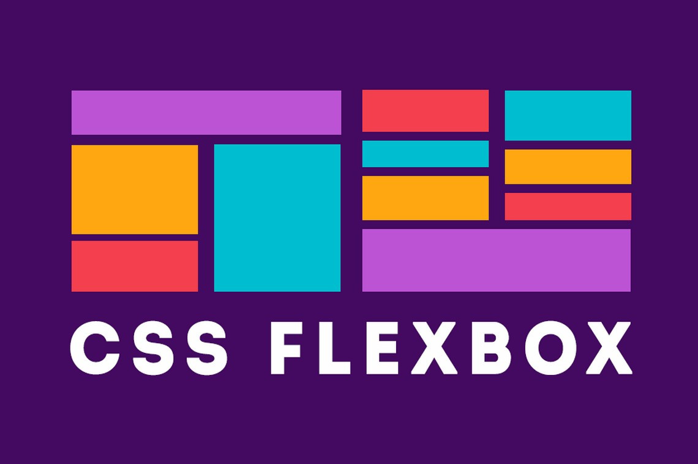

  

  
  
  

___

<h3 align="center">
  <a href="#information_source-sobre">Sobre</a>&nbsp;|&nbsp;
  <a href="#book-links-interessantes">Links</a>&nbsp;|&nbsp;
  <a href="#licença">Licença</a>
</h3>

___

 

# :information_source: Sobre

Projeto realizado no curso bonus do Bootcamp Goostack. Foi desenvolvida uma página do twitter, para prática dos conceitos de flexbox.

 

# :book: Links Interessantes

- [CSS Flexbox](https://www.w3schools.com/css/css3_flexbox.asp)
- [Conceitos básicos de flexbox](https://developer.mozilla.org/pt-BR/docs/Web/CSS/CSS_Flexible_Box_Layout/Conceitos_Basicos_do_Flexbox)
- [A Complete Guide to Flexbox](https://css-tricks.com/snippets/css/a-guide-to-flexbox/)
- [Guia flexbox](https://origamid.com/projetos/flexbox-guia-completo/)

 

## Licença 

Esse projeto está sob a licença MIT. Veja o arquivo [LICENSE](../LICENSE) para mais detalhes.