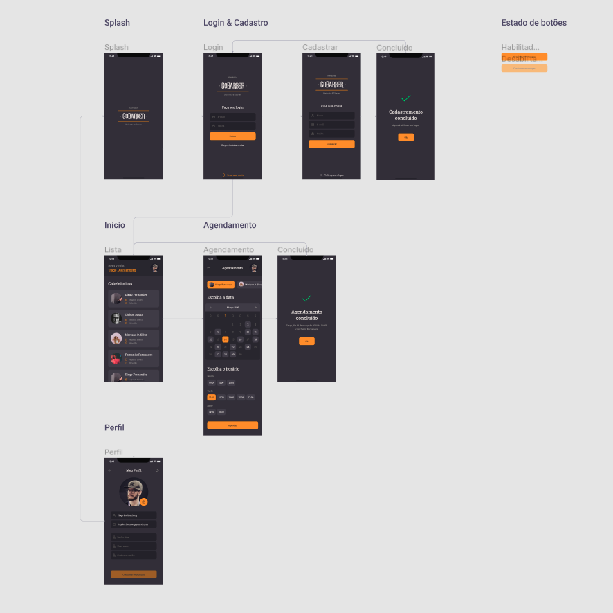

<h1 align="center">App GoBarber</h1>
<p align="center">
  
</p>


<p align="center">
  

  <a href="license.md">
  
  </a>
</p>

___

<h3 align="center">
  <a href="#information_source-sobre">Sobre</a>&nbsp;|&nbsp;
  <a href="#book-aulas">Aulas</a>&nbsp;|&nbsp;
  <a href="#rocket-tecnologias-frameworks-dependencias">Tecnologias</a>&nbsp;|&nbsp;
  <a href="#links">Baixar projeto</a>&nbsp;|&nbsp;
  <a href="#licença">Licença</a>
</h3>

___

<br>
<br>

# :information_source: Sobre

Criação da versão mobile da aplicação GoBarber.

<br>

# :book: Aulas

## :sparkles: Estrutura e padrões

<br>

### :pushpin: Configurando estrutura

Criação do projeto utiliando o CLI do React Native configuração do Eslint, Prettier e EditorConfig.

```bash
npx react-native init appgobarber --template react-native-template-typescript
```

<br>

### :pushpin: Figma GoBarber Mobile

<br>



<br><br>

### :pushpin: Configurando StatusBar

Configuração da statusbar da aplicação de forma bastante simples para que se aplique em todas as telas do GoBarber.

<br>

### :pushpin: Configuração de navegação

Configuração das duas primeiras páginas da aplicação que são as páginas de login e cadastro já com o *styled-components* que também será utilizado no mobile.

Na configuração da navegação na aplicação será utilizado o *[react-navigation](https://reactnavigation.org/docs/getting-started).*

<br>

### :pushpin: Importando fontes externas

Configuração e utilização de fontes externas no aplicativo.

<br>

## :sparkles: Autenticação e cadastro

<br>

### :pushpin: Input & Button

Construção dos componentes de input e botão já isolados pensando no mesmo caso da web para que possamos utilizar eles em mais de uma tela sem precisar recriar do zero. 

Entendimento sobre o funcionamento  dos inputs no mobile e suas diferenças entre plataformas (Android e iOS).

<br>

### :pushpin: Tela de autenticação

Finalização da tela de login, adicionando os links de Esqueci minha senha e Criar uma conta. Para que tudo funcione como deveria em ambas as plataformas, será utilizado um pacote externo para configurar a altura do botão de criar uma conta.

<br>

### :pushpin: Tela de cadastro

Criação da página de cadastro da aplicação, com reaproveitamento de tudo que já foi feito na tela de login e adição do que faltar, reaproveitando também os componentes que já foram isolados para esse propósito.
<br>

### :pushpin: Integrando Unform

Integração da aplicação com o mesmo pacote usado nos formulários da web que é o [Unform](https://unform.dev).

Instalação da lib:

```bash
yarn add @unform/core @unform/mobile
```

<br>

### :pushpin: Usuabilidade em formulários

Configuração de cada input para não corrigir o texto ou exibir a senha digitada, por exemplo.

Aplicação de acessibilidade nos botões do teclado para que, por exemplo, o usuário não precise dar foco manualmente no próximo input. Isso vai economizar bastante tempo do usuário na hora de preencher campos.

<br>

### :pushpin: Foco e preenchimento

Aplicação no mobile das mesmas características de usabilidade dos inputs da web para que fiquem com uma borda de outra cor ao receber foco e manter os ícones com a cor mudada caso o campo esteja preenchido mesmo se não estiver com foco.

<br>

### :pushpin: Validação dos formulários

Aplicação dos mesmos conceitos e o mesmo pacote usado para validação dos formulários na web e também ajuste dos inputs para exibirem a borda vermelha caso alguma validação não tenha passado.

<br>

## :sparkles: Concectando com a API

<br>

### :pushpin: Cadastro na aplicação

 Conexão da aplicação com a API usando o mesmo pacote que foi usado na web: o [Axios](https://github.com/axios/axios) e o envio dos dados de cadastro do GoBarber para a API.

<br>

### :pushpin: Autenticação de usuários

Realização da autenticação do usuário e lógica para mantê-lo logado usando o mesmo esquema do storage no browser mas aqui com outro pacote, já que o mobile não possui suporte nativo à um local storage.

<br>

### :pushpin: Rotas privadas

Configuração de qual rota estará ou não disponível para um usuário autenticado, fazendo um redirecionamento automático para a rota apropriada no momento em que o App for aberto.

<br>

# :rocket: Tecnologias, Frameworks e Dependências

- [ReactJs](https://pt-br.reactjs.org/)
- [TypeScript](https://www.typescriptlang.org/)
- [React Native](https://reactnative.dev/)
- [React Navigation](https://reactnavigation.org/docs/getting-started/)
- [Styled Components](https://styled-components.com)
- [React Native Vector Icons](https://www.npmjs.com/package/react-native-vector-icons)
- [Unform](https://unform.dev)
- [Yup](https://www.npmjs.com/package/yup)
- [Axios](https://github.com/axios/axios)
- [React Native Async Storage](https://github.com/react-native-async-storage/async-storage)

<br>

# :link: Como baixar o projeto

<br>

```bash
Clonar repositório
$ git clone https://github.com/nlnadialigia/GoStack.git

Acessar diretório
$ cd GoStack/GoStack-N3/appgbarber

Instalar dependências
$ yarn
```

## :information_source: Rodar o Projeto

- Deixar rodando a [api](../../GoStack-N2/gobarber-api) do projeto.
- Abrir 2 terminais e rodar:
  ```bash
  yarn start

  yarn android
  ```
- É necessário utilizar ou um Emulador ou o celular para que possa visualizar o aplicativo


<br>

### :pushpin: Considerações Finais

Projeto estrutura com [Eslint](https://eslint.org/) e [Prettier](https://prettier.io/). Para que não haja conflito entre as configurações é necessária a remoção da extensão Prettier do VSCode, caso a mesma esteja instalada.

**Configuração nas Settings(JSON)**
```json
"editor.codeActionsOnSave": {
  "source.fixAll.eslint": true
}
```
<br>

## Licença

Esse projeto está sob a licença MIT. Veja o arquivo [LICENSE](../../LICENSE) para mais detalhes.

