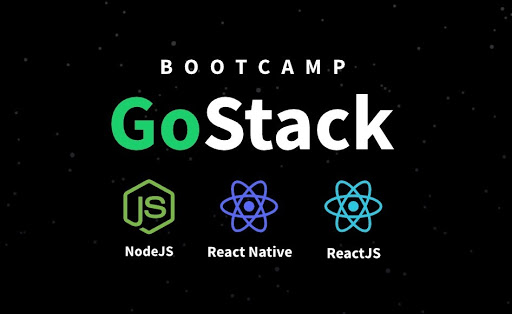

<h1 align="center">Continuando back-end do app</h1>
<p align="center">
  
</p>

<p align="center">
  

  <a href="license.md">
  
  </a>
</p>

___

<h3 align="center">
  <a href="#information_source-sobre">Sobre</a>&nbsp; |&nbsp;
  <a href="#book-aulas">Aulas</a>&nbsp; |&nbsp;
  <a href="#rocket-tecnologias-frameworks-dependencias">Tecnologias</a>&nbsp; |&nbsp;
  <a href="#links">Baixar projeto</a>&nbsp; |&nbsp;
  <a href="#licença">Licença</a>
</h3>

___

<br>
<br>

# :information_source: Sobre

Módulo para aprendizado de conceitos mais complexos do back-end da aplicação, como relacionamentos complexos, trabalhos em segundo plano, cacjhe, banco de dados não-relacionais e segurança.

# :book: Aulas

### ⁉️ Índice
**[A. Estrutura e Ajustes](#idA)**

  1.[Mapeando features do sistema](#id1)

**[B. Perfil do usuário](#idB)**

  2. [Aplicando TDD na prática](#id2)
  3. [Recuperação de senha](#id3)
  4. [Reset de senha](#id4)
  5. [Finalizando testes](#id5)
  6. [Salvando tokens no banco](#id6)
  7. [Emails em desenvolvimento](#id7)
  8. [Template de emails](#id8)
  9. [Template engine](#id9)
  10. [Refatoração dos testes](#id10)
  11. [Atualização do perfil](#id11)
  12. [Rota e controller de perfil](#id12)

**[C. Agendamento](#idC)**

  13. [Listagem de prestadores](#id13)
  14. [Filtrando agendamentos por mês](#id14)
  15. [Listando dias disponíveis](#id15)
  16. [Listando horários disponíveis](#id16)
  17. [Excluindo horários antigos](#id17)
  18. [Criação do agendamento](#id18)
  19. [Regras do agendamento](#id19)
  20. [Rotas e controllers](#id20)


### ⁉️ Estrutura e Ajustes<div id='idA'/>

#### 📌 Mapeando features do sistema<div id='id1'/>

- Mapeamento das features que ainda faltam serem implementadas e transcrição para um documento, listando os requisitos funcionais, requisitos não funcionais e regras de negócio que forem identificados para que fique mais fácil podermos consultar ao longo do desenvolvimento.

✨ **Legenda:**
 - **RF ⇒ Requisitos Funcionais** ⇒ quais as funcionalidades que vai existir dentro de Recuperação de senha.

 - **RNF ⇒ Requisitos não Funcionais** ⇒ não ligadas diretamente com a regra de negócio da aplicação. Por exemplo: qual biblioteca será utilizada para envio de email, qual banco de dados será utilizado.

 - **RN ⇒ Regras de Negócios** ⇒ sempre atrelada aos requisitos funcionais.

✨ **Mapeamento de requisitos e regras de negócios**

- **Recuperação de senha**
  - **RF**
    - O usuário deve poder recuperar sua senha informando seu email
    - O usuário deve receber um email com instruções de recuperação de senha
    - O usuário deve poder resetar sua senha
    <br>

  - **RNF**
    - Utilizar [Mailtrap](https://mailtrap.io/) para testar envios em ambiente de desenvolvimento
    - Utilizar o [Amazon SES](https://aws.amazon.com/pt/ses/) para envios em produção
    - O envio de email deve acontecer em segundo plano(background job)
    <br>

  - **RN**
    - O link enviado por email para resetar senha deve expirar em 2hs
    - O usuário precisa confirmar a nova senha para que a mesma seja resetada
    <br>

- **Atualização do perfil**
  - **RF**
    - O usuário deve poder atualizar seu nome, email e senha
    <br>

  - **RN**
    - O usuário não pode alterar seu email já utilizado
    - Para atualizar sua senha, o usuário deve informar a senha antiga
    - Para atualizar sua senha o usuário deve confirmar a sua senha
    <br>

- **Painel do prestador**
  - **RF**
    - O usuário deve pode listar seus agendamentos de um dia específico
    - O prestador deve receber uma notificação sempre que houver novo agendamento
    - O prestador deve poder visualizar as notificações não lidas
    - As notificações do prestador devem ser enviadas em tempo real utilizando [Socket.io](https://socket.io/)
    <br>

  - **RNF**
      - Os agendamentos do prestador no dia devem ser armazenados em cache
      - As notificações do prestador devem ser armazenadas no [MongoDB](https://www.mongodb.com/2)
      <br>

  - **RN**
    - A notificação deve ter um status de lida ou não-lida para que o prestador possa controlar
    <br>

- **Agendamento de serviços**
  - **RF**
    - O usuário deve poder listar todos os prestadores de serviços cadastrados
    - O usuário deve poder listar os dias de um mẽs com pelo menos um horário disponível de um prestador
    - O usuário deve poder listar horários disponíveis em um dia específico de um prestador
    - O usuário deve poder realizar um novo agendamento com um prestador
    <br>

  - **RNF**
    - A listagem de prestadores deve ser armazenada em cache
    <br>

  - **RN**
    - Cada agendamento deve durar 1h exatamente
    - Os agendamentos devem estar disponíveis entre 8hs às 18hs (Primeiro horário às 8 e o último as 17)
    - O usuário não pode agendar em um horário já ocupado
    - O usuário não pode agendar em um horário que já passou
    - O usuário não pode agendar serviços consigo mesmo
    <br>

✨ **Referência:** [Utilizando UX para projetar uma aplicação do zero | Masterclass #09](https://www.youtube.com/watch?v=mxIhSTP6ddE)

### ⁉️ Perfil do usuário<div id='idB'/>

#### 📌 Aplicando TDD na prática<div id='id2'/>
  - Implementação da feature de recuperação de senha, aplicando os conceitos aprendidos sobre TDD, criando um teste antes de criar a funcionalidade.
  - os testes unitários são criados baseados nos services, por isso é importante manter a estrutura base antes de criar os testes.
  - como não há a estrutura de envio de emails na aplicação, será necessária a criação da estrutura básica para que se possa realizar os testes.
  - a integração com api externa será sempre no **Provider**.
  - ***Roteiro***
    - criação do teste ⇒ irá falhar porque não houve a criação da funcionalidade no service;
    - criação da lógica ⇒ testar novamente e o teste deverá passar;
    - as injeções de dependências (`@inject`) serão implementadas posteriormente no ***@shared/container/index.ts***;
    - após as alterações na lógica é necessário alterar o arquivo de teste para incluir a dependência.

#### 📌 Recuperação de senha<div id='id3'/>

Implementação da feature de não recuperação de senha para usuários que não existam e criação de uma solução para garantir que quem gerou a solicitação de troca de senha foi realmente o titular da conta.

#### 📌 Reset de senha<div id='id4'/>

Implementação da funcionalidade de reset da senha usando um token gerado com a funcionalidade da aula anterior.

#### 📌 Finalizando testes<div id='id5'/>

Finalização dos testes e a implementação do service de reset de senha, adicionando os testes que foram mapeados no final da aula anterior, concluindo mais uma feature.

#### 📌 Salvando tokens no banco<div id='id6'/>

Implementação das rotas e controllers referentes à recuperação e reset de senha e a parte de tokens para que seja salvo no banco, criando a tabela, repositório e registrando esse repositório no container para injeção de dependência.

#### 📌 Emails em desenvolvimento<div id='id7'/>

Implementação do provider para o envio de e-mails em ambiente de desenvolvimento usando o pacote `nodemailer` e registro dele nos containers para injeção de dependências.

#### 📌 Template de emails<div id='id8'/>

Configuração do `handlebars` que é um pacote de template engine, permitindo que a aplicação envie e-mails a partir de templates configurados previamente apenas inserindo os dados que queremos incluir em cada mensagem.

#### 📌 Template engine<div id='id9'/>

Melhoria na forma como os e-mails são enviados pela aplicação usando o `handlebars`. Assim, os e-mails poderão ser enviados em formato HTML e CSS com formatações e estilizações customizadas, além de nos permitir criar vários templates de acordo com a necessidade da aplicação.

#### 📌 Refatoração dos testes<div id='id10'/>

Refatoração dos testes adicionando o `beforeEach` exatamente como foi usado nos testes de recuperação de senha para que os testes fiquem mais limpos e também para caso precisarmos adicionar mais testes nesses arquivos já criados.

#### 📌 Atualização do perfil<div id='id11'/>

Construção da parte de atualização do perfil de usuário, também seguindo a metodologia de TDD, nos guiando pelos testes e fazendo toda a validação necessária.

#### 📌 Rota e controller de perfil<div id='id12'/>

Conclusão da funcionalidade de atualização do perfil de um usuário adicionando a rota e o controller para que tudo possa funcionar normalmente com as requisições pelo insomnia e criação de um service e uma rota a mais que servirá para exibir as informações do perfil a serem editadas. Isso complementará a funcionalidade de atualização do perfil.

### ⁉️ Agendamento<id='idC'/>

#### 📌 Listagem de prestadores<div id='id13'/>

Configuração da parte de agendamento de serviços na aplicação, iniciando pela parte de listagem de prestadores.

#### 📌 Filtrando agendamentos por mês<div id='id14'/>

Listagem de dias de um prestador onde haja pelo menos um horário disponível para reserva de serviço e funcionalidades para mexer com datas, uma função global de strings e como fazer `raw queries` usando o *TypeORM*.

#### 📌 Listando dias disponíveis<div id='id15'/>

Formatação dos dados vindos da `query` feita na aula anterior e aqui aprendizado de um novo método global só que dessa vez de *arrays*.

#### 📌 Listando horários disponíveis<div id='id16'/>

Listagem de horários disponíveis num dia em que haja disponibilidade para agendamento de serviços, com a implementação de um novo método no repositório responsável por fazer essa `query`.

#### 📌 Excluindo horários antigos<div id='id17'/>

Acréscmio uma regra de negócio para impedir que um agendamento seja feito em uma data passada.

#### 📌 Criação do agendamento<div id='id18'/>

Acréscimo de um campo de id do usuário na tabela appointments que está fazendo o agendamento com o prestador para que seja feito um relacionamento e identificar quem é esse usuário pela nossa aplicação e modificar o repositório, service e controller para que funcione com esse campo adicional na criação do agendamento.

#### 📌 Regras do agendamento<div id='id19'/>

Modificação da regra de negócio do service de criação de um agendamento, evitando por exemplo que um usuário faça um agendamento com ele mesmo ou em datas passadas, além de disponibilizar apenas horários válidos para a aplicação (das 8h às 18h).

#### 📌 Rotas e controllers<div id='id20'/>

Finalização de todas essas novas features de disponibilidade de mês e dia e criação das rotas e controllers deixando tudo funcionando como deveria pelas requisições nas rotas da aplicação.

# 🔗 Como baixar o projeto

``` js
// Clonar repositório
$ git clone https: github.com/nlnadialigia/GoStack.git

// Acessar diretório
$ cd GoStack/GoStack-N4/gobarber-api

// Instalar dependências
$ yarn

// Iniciar projeto
$ yarn dev:sever
```

<br>

## Licença

Esse projeto está sob a licença MIT. Veja o arquivo [LICENSE](../../LICENSE) para mais detalhes.
